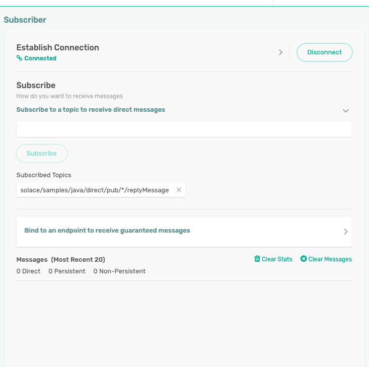

## Contents

This sample builds a Spring Boot based application that acts as a processor of events.
It consumes an incoming event on a subscribed topic and in turn publishes a new event on a separate topic using the Solace PubSub+ Messaging API for Java (not JCSMP).

## Prerequisites
Install the data model

``` bash
cd spring-boot-datamodel
mvnw clean install
```
## Configure PubSub+ Access
Add your messaging service client information to `applicaton.yml`. Find your connection info as seen in the [Connection Information section](#connection-information)

## Run the Sample
``` bash
cd spring-boot-processor
mvnw clean spring-boot:run
```

## Exploring the Sample

This sample acts as a processor i.e. consumes and publishes events at the same time. 
The events for consumption come from the topics mapped to the subscription `solace/samples/java/direct/pub/*`
The new message created is published to the topic structure `solace/samples/java/direct/pub/*/newOutboundMessage`

The corresponding producer application can be found on in this same project under the
repository [Spring-boot-api-producer](https://github.com/SolaceSamples/solace-samples-springboot/tree/main/spring-boot-api-producer)

## Connection Information
This tutorial requires access Solace PubSub+ messaging and requires that you know several connectivity properties about your Solace messaging. Specifically you need to know the following:

| Resources       | Value  | Description                                                                                                                               |
|-----------------|--------|-------------------------------------------------------------------------------------------------------------------------------------------|
| Host            | String | This is the address clients use when connecting to the PubSub+ messaging to send and receive messages. (Format: DNS_NAME:Port or IP:Port) |
| Message VPN     | String | The PubSub+ message router Message VPN that this client should connect to.                                                                |
| Client Username | String | The client username. (See Notes below)                                                                                                    |
| Client Password | String | The client password. (See Notes below)                                                                                                    |

There are several ways you can get access to PubSub+ Messaging and find these required properties.

### Option 1: Use PubSub+ Cloud
Follow these instructions to quickly spin up a cloud-based PubSub+ messaging service for your applications.
The messaging connectivity information is found in the service details in the connectivity tab (shown below). You will need:

* Host:Port (use the SMF URI)
* Message VPN
* Client Username
* Client Password


### Option 2: Start a PubSub+ Software
Follow [these instructions](https://docs.solace.com/Get-Started/Getting-Started-Try-Broker.htm) to start the PubSub+ Software in leading Clouds, Container Platforms or Hypervisors. The tutorials outline where to download and how to install the PubSub+ Software.
The messaging connectivity information are the following:

* Host: <public_ip> (IP address assigned to the VMR in tutorial instructions)
* Message VPN: default
* Client Username: sampleUser (can be any value)
* Client Password: samplePassword (can be any value)
  Note: By default, the PubSub+ Software "default" message VPN has authentication disabled.

## Inspect Output Messages
To inspect the messages being produced, subscribe to the configured topic in the broker console's **Try-Me**
tab : 
