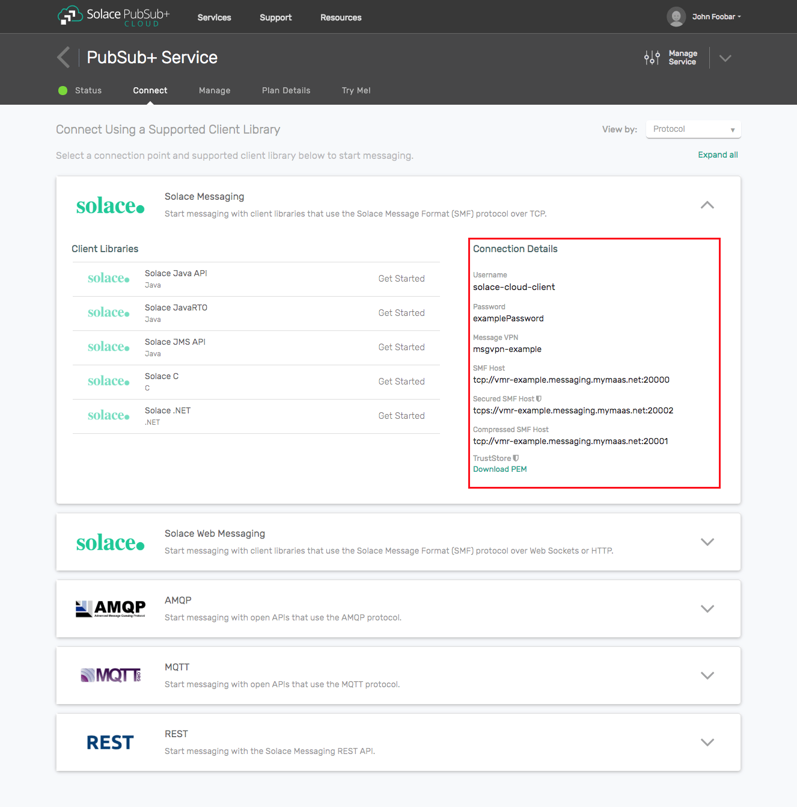

# spring-boot-request-reply

Spring Boot sample demonstrating the **guaranteed request/reply** interaction pattern with the [Solace PubSub+ Messaging API for Java](https://docs.solace.com/API/Solace-PubSub-Messaging-APIs/Java-API-Home.htm). Both the requester and the replier run in a single JVM to make the full round-trip easy to observe end-to-end.

## 1. The Request/Reply Pattern — Conceptually

Request/reply is a synchronous-style interaction built on top of asynchronous messaging. A **requester** publishes a message expecting a **response**; a **replier** consumes those messages, processes them, and sends the response back on a destination the requester is listening to.

Compared to related patterns:
- **Fire-and-forget pub/sub** — the publisher never expects a response. Request/reply layers a return path on top.
- **Plain point-to-point queuing** — decouples producer and consumer but again does not return anything.
- **REST/HTTP** — connection-oriented and short-lived. Request/reply over messaging survives broker restarts, decouples the peers, and buffers demand.

Three building blocks appear in every request/reply implementation:
1. **Correlation ID** — a unique per-request token echoed on the reply so the requester matches responses to outstanding requests.
2. **Reply-to destination** — where the replier should send the response. Attached to the request message so the replier does not need static knowledge of the requester.
3. **Timeout / deadline** — an upper bound on how long the requester will wait before treating the request as failed.

Choose request/reply over plain pub/sub when the caller needs an answer. Choose it over HTTP when the request represents work that must survive broker or consumer restarts, or when you want a decoupled, buffered, and independently-scalable back end.

## 2. Direct vs Guaranteed Request/Reply in Solace

The Solace Java Messaging API supports two flavors:

| | Direct request/reply | Guaranteed request/reply (this sample) |
|---|---|---|
| Persistence | None — replies live only in memory | Requests and replies stored durably on the broker |
| API | `RequestReplyMessagePublisher` / `RequestReplyMessageReceiver` | Composed manually from `PersistentMessagePublisher` + `PersistentMessageReceiver` |
| Latency | Low | Higher (persistence overhead) |
| Failure mode | Reply lost if requester disconnects mid-flight | Reply queued until requester reconnects |
| Ack handling | None | Explicit `ACCEPTED` / `REJECTED` / `FAILED` settlement |
| When to use | Fast, idempotent lookups | Work that must not be lost |

This sample demonstrates the **guaranteed** flavor because it exposes the interesting mechanics — correlation, reply-to, ack semantics, queue provisioning — that a production request/reply implementation must handle.

## 3. How This Sample Implements It

```
                                  ┌────────────────────────────────────┐
                                  │  spring-boot-request-reply (1 JVM) │
                                  │                                    │
POST /request  ──────────────▶ SensorReadingRequestController          │
  {payload}                       │            │                       │
                                  │            ▼                       │
                                  │       SolaceRequester              │
                                  │  ┌──────────────────────────────┐  │
                                  │  │ 1. generate correlationId    │  │
                                  │  │ 2. set replyTo (topic)       │  │
                                  │  │ 3. persistent publish to     │  │
                                  │  │    request topic             │◀─┼──── returns 202 + correlationId
                                  │  │                              │  │
                                  │  │ 6. reply arrives on REPLY_Q  │  │
                                  │  │    → log by correlationId    │  │
                                  │  │    → settle(ACCEPTED)        │  │
                                  │  └──────────────────────────────┘  │
                                  │            ▲                       │
                                  │       ┌────┴─────┐                 │
                                  │       │ REPLY_Q  │ (durable excl.) │
                                  │       └──────────┘                 │
                                  │            ▲                       │
                                  │       SolaceReplier                │
                                  │  ┌──────────────────────────────┐  │
                                  │  │ 4. receive from REQUEST_Q    │  │
                                  │  │    read correlationId+replyTo│  │
                                  │  │ 5. build response POJO       │  │
                                  │  │    persistent publish to     │  │
                                  │  │    replyTo topic             │  │
                                  │  │    settle(ACCEPTED)          │  │
                                  │  └──────────────────────────────┘  │
                                  │            ▲                       │
                                  │       ┌────┴─────┐                 │
                                  │       │REQUEST_Q │ (durable excl.) │
                                  │       └──────────┘                 │
                                  └────────────────────────────────────┘
```

**Message-property mechanics.** Both the correlation ID and the reply-to destination are carried as **user-defined message properties** named `correlationId` and `replyTo`. They are set on outbound messages via `OutboundMessageBuilder.withProperty(...)` and read on inbound messages via `InboundMessage.getProperty(...)`. Note: `solace-messaging-client` 1.6.0 also exposes a well-known SMF correlation-id header key (`SolaceProperties.MessageProperties.CORRELATION_ID`) plus a typed getter `InboundMessage.getCorrelationId()`, but in this SDK version setting the header via `withProperty(...)` does not round-trip back through the typed getter — so this sample uses plain user properties for both fields, which is the mechanism that works reliably end-to-end here.

**Why reply-to is a topic (not a queue name).** The requester's reply queue is provisioned with a topic subscription. The replier publishes replies to the topic, not to the queue directly. This mirrors the durable-queue-with-topic-subscription pattern already used in `spring-boot-consumer` and keeps the replier decoupled from the requester's queue topology.

**Two beans in one JVM.** `SolaceRequester` owns a persistent publisher (writing requests to the request topic) plus a persistent receiver on the reply queue. `SolaceReplier` owns a persistent receiver on the request queue plus a persistent publisher (writing replies to whatever topic the inbound `replyTo` property names). The controller layer only knows about `SolaceRequester`.

**Async REST semantics.** `POST /solace/samples/spring/boot/request-reply/request` returns `202 Accepted` immediately with `{ "correlationId": "..." }`. The reply arrives on the reply queue asynchronously and is logged. This decouples HTTP request timing from broker delivery — an HTTP call blocked on an unbounded broker round-trip is a classic outage waiting to happen.

**Settlement semantics.**
- `ACCEPTED` — message handled successfully; the broker removes it.
- `REJECTED` — message is malformed and should not be retried; the broker discards it (routing to a Dead Message Queue if configured).
- `FAILED` — transient error; the broker redelivers the message. Because of this, replier logic must be **idempotent**.

## 4. Configuration Reference

| Property | Meaning | Default |
|---|---|---|
| `server.port` | HTTP port for the REST endpoint | `8082` |
| `solace.hostUrl` | Broker connection URL | `tcp://localhost:55555` |
| `solace.vpnName` | Solace message VPN | `default` |
| `solace.userName` / `solace.password` | Client credentials | `default` / `default` |
| `solace.reconnectionAttempts` | Reconnection attempts on transport loss | `20` |
| `solace.connectionRetriesPerHost` | Retries per host on initial connect | `5` |
| `solace.requestQueue.name` | Durable-exclusive queue the replier consumes from | `sample/request/queue` |
| `solace.requestQueue.subscription` | Topic the request queue subscribes to; the requester publishes here | `solace/samples/request-reply/request` |
| `solace.replyQueue.name` | Durable-exclusive queue the requester consumes replies from | `sample/reply/queue` |
| `solace.replyQueue.subscription` | Topic the reply queue subscribes to; carried as `replyTo` on outbound requests | `solace/samples/request-reply/reply` |
| `solace.requestTopic` | Topic the requester publishes requests to (must match `requestQueue.subscription`) | `solace/samples/request-reply/request` |
| `solace.replyTimeoutMs` | How long to wait before dropping a pending correlationId and logging a timeout | `10000` |

Both queues are provisioned with `MissingResourcesCreationStrategy.CREATE_ON_START`, so they will be created automatically the first time the app runs against a broker where they do not exist.

## 5. Running the Sample

**Install the shared data model** (once):

```bash
cd spring-boot-datamodel
./mvnw clean install
cd ..
```

**Point the sample at a broker.** Populate `solace.hostUrl`, `solace.vpnName`, `solace.userName` and `solace.password` in `application.yml` with the connection parameters of your Solace PubSub broker. See [Section 6 — Connection Information](#6-connection-information) below for the two supported options (Solace Cloud service or a local Solace PubSub software broker).

**Run the sample:**

```bash
cd spring-boot-request-reply
./mvnw clean spring-boot:run
```

**Trigger a request:**

```bash
curl -i -X POST http://localhost:8082/solace/samples/spring/boot/request-reply/request \
     -H 'Content-Type: application/json' \
     -d '{"sensorID":"sensor-1","operation":"LATEST_READING"}'
```

Expected HTTP response:
```
HTTP/1.1 202 Accepted
Content-Type: application/json
...
{"correlationId":"<uuid>"}
```

Expected log sequence (all five lines share the same `correlationId`):
1. `Received HTTP POST /request body=SensorReadingRequest(...)`
2. `Published request correlationId=<uuid> topic=solace/samples/request-reply/request payload=...`
3. `Received request correlationId=<uuid> replyTo=solace/samples/request-reply/reply request=...` — replier
4. `Published reply correlationId=<uuid> to topic=solace/samples/request-reply/reply payload=...` — replier
5. `Received reply correlationId=<uuid> latencyMs=<n> response=...`

## 6. Connection Information

This sample requires access to a Solace PubSub broker and the following four connection parameters:

| Parameter       | Description                                                                                                                               |
|-----------------|-------------------------------------------------------------------------------------------------------------------------------------------|
| Host            | Address the client connects to (`Host:Port` in `tcp://` or `tcps://` form). Maps to `solace.hostUrl` in `application.yml`.                |
| Message VPN     | The Solace PubSub broker Message VPN the client should join. Maps to `solace.vpnName`.                                                    |
| Client Username | Client username used to authenticate. Maps to `solace.userName`.                                                                          |
| Client Password | Client password used to authenticate. Maps to `solace.password`.                                                                          |

You can get these values in one of two ways.

### Option 1: Solace Cloud

Follow [these instructions](https://docs.solace.com/Cloud/ggs_create_first_service.htm) to spin up a cloud-based Solace PubSub broker service. Once the service is running, open the service in Solace Cloud Console and switch to the **Connect** tab. Under **Solace Messaging** you will find the four parameters this sample needs:

* **Host:** use the **SMF URI** (`tcps://...:55443` for TLS or `tcp://...:55555` for plaintext).
* **Message VPN:** the VPN name shown on the same page.
* **Client Username** and **Client Password:** the credentials shown on the same page.



Paste those four values into `spring-boot-request-reply/src/main/resources/application.yml`. Both `sample/request/queue` and `sample/reply/queue` will be created automatically on first run because the beans use `MissingResourcesCreationStrategy.CREATE_ON_START` — no manual queue provisioning is required, provided the client user has the *Client Profile* permission to create endpoints. In Solace Cloud, the default client user has this permission.

### Option 2: Local Solace PubSub software broker (Docker)

Follow [these instructions](https://docs.solace.com/Software-Broker/SW-Broker-Set-Up/Containers/Set-Up-Container-Image.htm) or just run the standard container:

```bash
docker run -d -p 55555:55555 -p 8008:8008 -p 8080:8080 -p 8741:8741 -p 8443:8443 -p 9000:9000 \
  --shm-size=1g --env username_admin_globalaccesslevel=admin --env username_admin_password=admin \
  --name=solace solace/solace-pubsub-standard
```

Then use these connection parameters (the defaults in the shipped `application.yml`):

* **Host:** `tcp://localhost:55555`
* **Message VPN:** `default`
* **Client Username:** `default`
* **Client Password:** `default`

The `default` message VPN has authentication disabled out of the box, so any username/password combination is accepted.

### Verifying the flow in the broker

Once the sample is running, open the broker's **Try-Me** tab in the console (Solace Cloud UI or the local broker at [http://localhost:8080](http://localhost:8080)) and subscribe to `solace/samples/request-reply/>` to observe both the request and reply messages as they flow through the broker. The two auto-created queues (`sample/request/queue` and `sample/reply/queue`) are visible on the **Queues** tab and can be inspected there as well.

## 7. Adapting for Production Use

This module is a teaching tool, not a production template. When taking these ideas into production, address the following:

- **Split the roles.** Run the requester and replier as separate, independently deployable applications. Bundling them in one JVM is a pedagogical choice; in the real world you want independent scaling, deployment cadence, and failure isolation.
- **Reply-to hygiene.** Validate the inbound `replyTo` value against an **allow-list** of known reply topics. Blindly publishing to a client-supplied destination is a reflection / DoS vector.
- **Correlation lifecycle.** This sample tracks in-flight correlationIds in a `ConcurrentHashMap` inside a single JVM. Once the requester is horizontally scaled — or the reply may outlive the JVM that sent the request — move correlation state to a distributed store (Redis, a database, a cache).
- **Timeouts and idempotency.** Enforce an explicit request deadline. After it expires, mark the request failed and stop expecting a reply. Because `FAILED` settlement causes broker redelivery, replier logic **must be idempotent**.
- **DMQ and poison messages.** Configure a Dead Message Queue on both the request and reply queues, and set a max-redelivery count. Malformed messages that always fail should end up in the DMQ, not loop forever.
- **Backpressure and flow control.** Tune publisher backpressure (`onBackPressureWait`, `onBackPressureReject`, buffered mode) to match your throughput/latency budget. Consider a bounded work queue inside the replier to protect downstream systems.
- **Reply-queue topology.** For multi-instance requesters, either give each instance a dedicated reply queue (per-instance name or temp queue) or use a shared exclusive queue plus the distributed correlation store. A shared **non-exclusive** reply queue causes replies to fan out to the wrong instance.
- **Security.** Enable TLS (`tcps://`), use client-certificate or OAuth authentication, and apply ACLs restricting who may publish/subscribe to the request and reply destinations.
- **Observability.** Emit metrics for outstanding request count, reply latency, timeout rate, and settlement counts. The `pending` map's size is a good starting gauge; add a `Micrometer` `Gauge` for it.
- **Schema evolution.** Request and response POJOs are serialized as JSON. Coordinate additive-only changes and version fields, or graduate to a formal schema (Avro / Protobuf) with a registry once the contract stabilizes.

## 8. Further Reading

- [Solace PubSub+ Messaging API for Java — Documentation](https://docs.solace.com/API/Solace-PubSub-Messaging-APIs/Java-API-Home.htm)
- [Guaranteed Messaging in Solace PubSub+](https://docs.solace.com/API/Solace-PubSub-Messaging-APIs/Java-API/Java-Guaranteed-Messaging.htm)
- Sibling samples in this repo: `spring-boot-api-producer`, `spring-boot-consumer`, `spring-boot-processor`.
